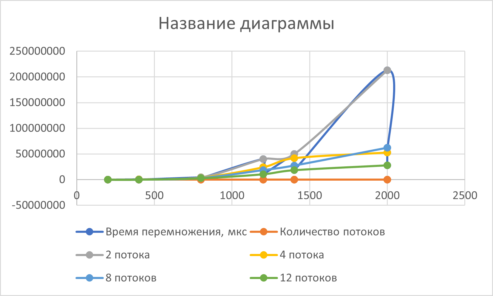

# parallel-programming
Отчёт
Результаты исследований:
Перемножение матриц
200*200 матрицы 
2 потока - 73202 микросекунд 
4 потока - 37769 микросекунд 
8 потока - 29203 микросекунд 
12 потока - 25170 микросекунд 

400*400 матрицы
2 потока - 564688 микросекунд 
4 потока - 293936 микросекунд 
8 потока - 217966 микросекунд 
12 потока - 170716 микросекунд

800*800 матрицы
2 потока - 4518425 микросекунд 
4 потока - 4065205 микросекунд 
8 потока - 3483881 микросекунд 
12 потока - 2822567 микросекунд

1200*1200 матрицы 
2 потока - 40245505 микросекунд 
4 потока - 24138293 микросекунд 
8 потока - 18659341 микросекунд 
12 потока - 10616659 микросекунд

1400*1400 матрицы
2 потока - 49765192 микросекунд 
4 потока - 41884823 микросекунд 
8 потока - 27492319 микросекунд 
12 потока - 18451591 микросекунд

2000*2000 матрицы
2 потока - 213193658 микросекунд 
4 потока - 52914481 микросекунд 
8 потока - 61884282 микросекунд 
12 потока - 27832027 микросекунд
Таблица результатов

## Matrix Multiplication Time (microseconds)

| Matrix Size | 2 threads | 4 threads | 8 threads | 12 threads |
|-------------|-----------|-----------|-----------|------------|
| 200 × 200   | 73,202    | 37,769    | 29,203    | 25,170     |
| 400 × 400   | 564,688   | 293,936   | 217,966   | 170,716    |
| 800 × 800   | 4,518,425 | 4,065,205 | 3,483,881 | 2,822,567  |
| 1200 × 1200 | 40,245,505| 24,138,293| 18,659,341| 10,616,659 |
| 1400 × 1400 | 49,765,192| 41,884,823| 27,492,319| 18,451,591 |
| 2000 × 2000 | 213,193,658| 52,914,481| 61,884,282| 27,832,027|

График:

Варианты всех матриц содержаться внутри проекта
Вывод:
Написав программу на языке С++ для перемножения двух матриц(что включало написания класса матриц с представлением через строку чисел с типом данных double, а также разбиение класса на стандартный список объявления и определения + функция main с демонстрацией всего выше перечисленного) также мы добавили вариативность в области выбора количества потоков для выполнения операции умножения. Мы провели эксперимент по замеру времени процесса умножения двух матриц меняя количество потоков, а также сравнили результаты с аналогичным процессом, написанным на Python с использованием встроенных библиотек. Результат оказался вполне приятным, так как финальные файлы совпали по содержимому. Столкнулся единственный раз с проблемой неудовлетворительного чтения файла, который был создан в результате программы, во время верификации и сравнения результатов. Но сие программное беззаконие устранил и получил рабочую систему. В результате мы получили совпадение по результату умножения матриц и время, за которое оно было осуществлено. 

