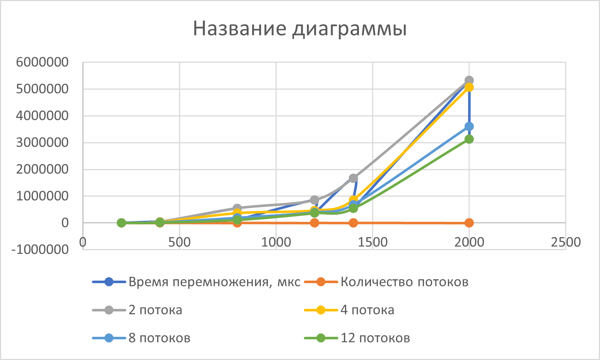

# parallel-programming
Отчёт
Таблица результатов

| Размер матрицы | 2 процесса | 4 процесса | 8 процессов | 12 процессов |
|:--------------:|-----------:|-----------:|------------:|-------------:|
| 200 × 200      | 6 541      | 3 361      | 1 666       | 1 156        |
| 400 × 400      | 49 453     | 35 701     | 18 893      | 13 225       |
| 800 × 800      | 547 137    | 364 975    | 189 084     | 114 174      |
| 1200 × 1200    | 854 845    | 468 233    | 391 933     | 367 744      |
| 1400 × 1400    | 1 672 959  | 862 674    | 682 336     | 540 138      |
| 2000 × 2000    | 5 327 450  | 5 072 711  | 3 608 651   | 3 137 488    |

График:

Варианты всех матриц содержаться внутри проекта
Вывод:
Написав программу на языке С++ для перемножения двух матриц(что включало написания класса матриц с представлением через строку чисел с типом данных double, а также разбиение класса на стандартный список объявления и определения + функция main с демонстрацией всего выше перечисленного) мы провели эксперимент по замеру времени процесса умножения двух матриц, а также сравнили результаты с аналогичным процессом, написанным на Python с использованием встроенных библиотек.Также, следуя заданию, мы модернизировали процесс при помощи принципов технологии MPI. Результат оказался вполне приятным, так как финальные файлы совпали по содержимому. Столкнулся единственный раз с проблемой неудовлетворительного чтения файла, который был создан в результате программы, во время верификации и сравнения результатов. Но сие программное беззаконие устранил и получил рабочую систему. В результате мы получили совпадение по результату умножения матриц и время, за которое оно было осуществлено. Также мы составили статитстику результатов, меняя размер матриц и количество потоков.

