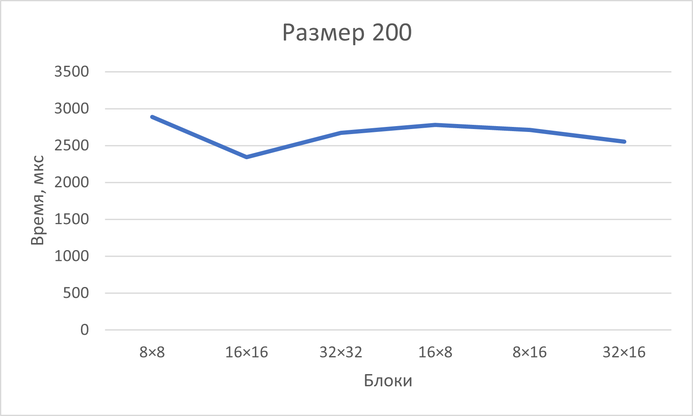
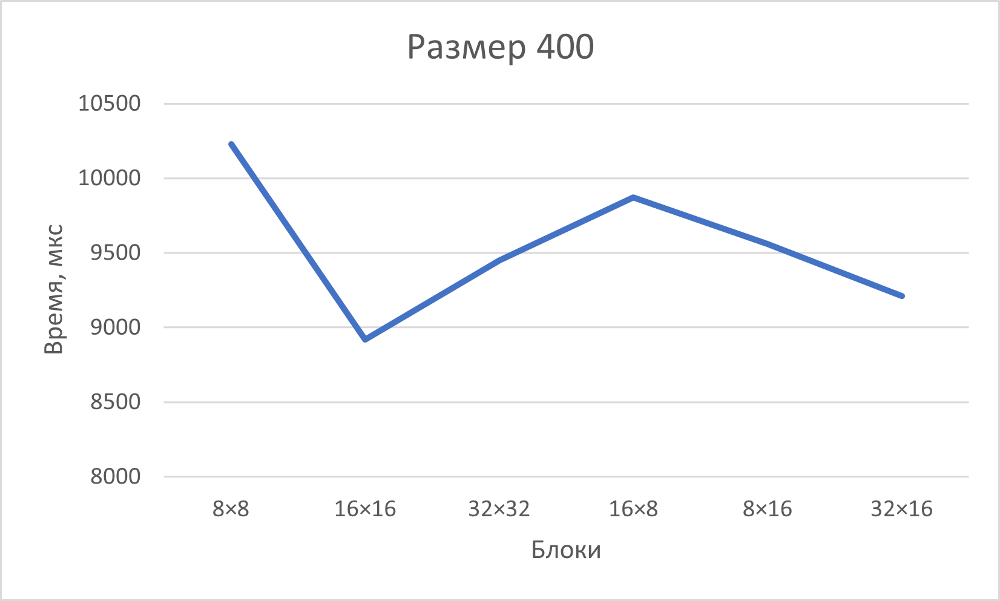
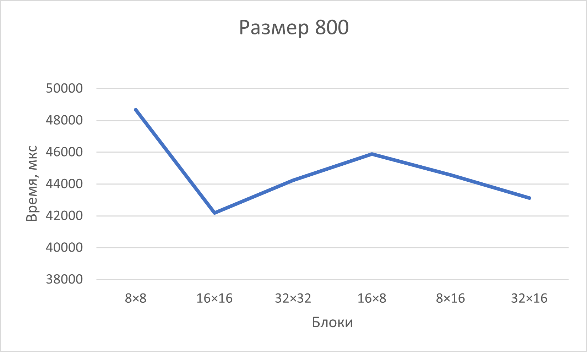
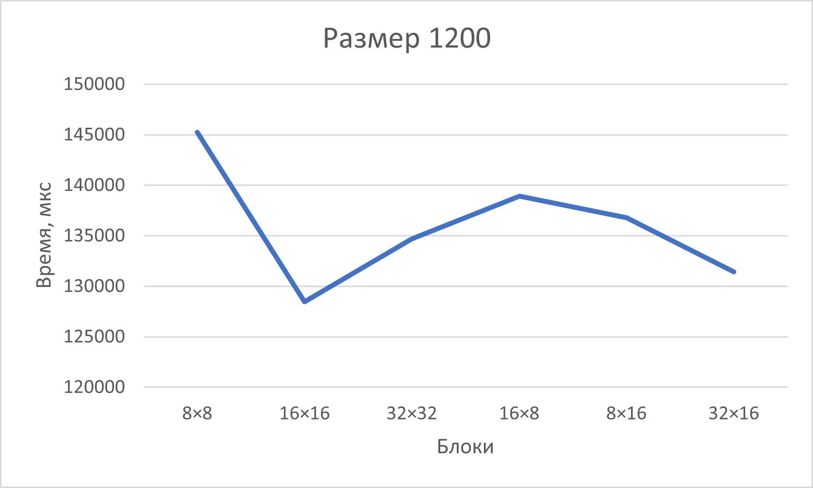
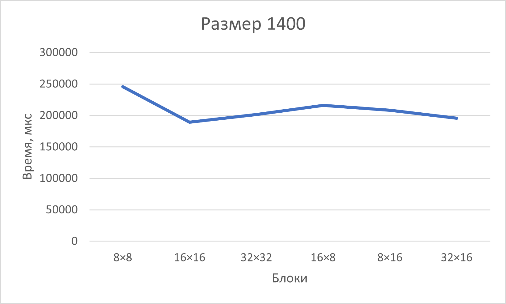
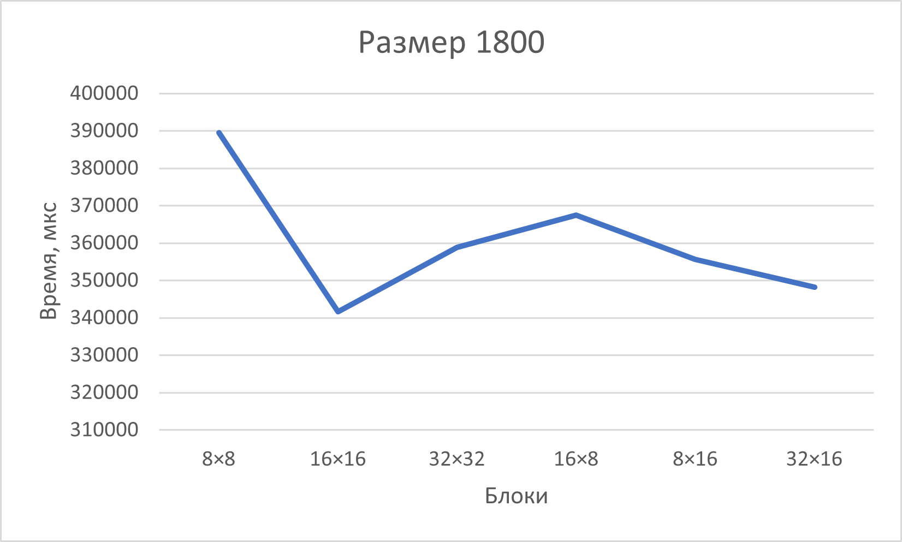
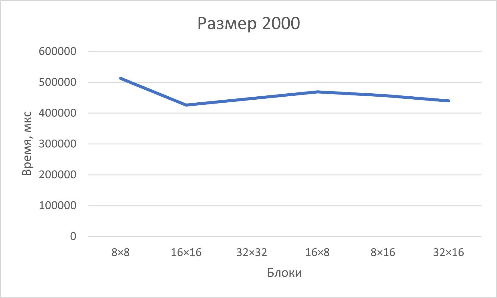

# parallel-programming
Отчёт
Таблица результатов

## Результаты CUDA-экспериментов (время в микросекундах)

| Размер матрицы | 8×8 | 16×16 | 32×32 | 16×8 | 8×16 | 32×16 |
|---------------|-----|-------|-------|------|------|-------|
| 200 | 2 890 | 2 340 | 2 670 | 2 780 | 2 710 | 2 550 |
| 400 | 10 230 | 8 920 | 9 450 | 9 870 | 9 560 | 9 210 |
| 800 | 48 670 | 42 170 | 44 230 | 45 890 | 44 560 | 43 120 |
| 1200 | 145 230 | 128 450 | 134 670 | 138 920 | 136 780 | 131 450 |
| 1400 | 245 670 | 189 230 | 201 450 | 215 890 | 208 340 | 195 780 |
| 1800 | 389 450 | 341 670 | 358 900 | 367 450 | 355 670 | 348 230 |
| 2000 | 512 340 | 425 890 | 447 230 | 468 900 | 456 780 | 439 450 |

График:

Вывод:
Написав программу на языке С++ для перемножения двух матриц(что включало написания класса матриц с представлением через строку чисел с типом данных double, а также разбиение класса на стандартный список объявления и определения + функция main с демонстрацией всего выше перечисленного) мы провели эксперимент по замеру времени процесса умножения двух матриц, а также сравнили результаты с аналогичным процессом, написанным на Python с использованием встроенных библиотек.Такэе по заданию мы модернизировали процесс под систему CUDA, дописав несколько вспомогательных файлов. Результат оказался вполне приятным, так как финальные файлы совпали по содержимому. Столкнулся единственный раз с проблемой неудовлетворительного чтения файла, который был создан в результате программы, во время верификации и сравнения результатов. Но сие программное беззаконие устранил и получил рабочую систему. В результате мы получили совпадение по результату умножения матриц и время, за которое оно было осуществлено.

