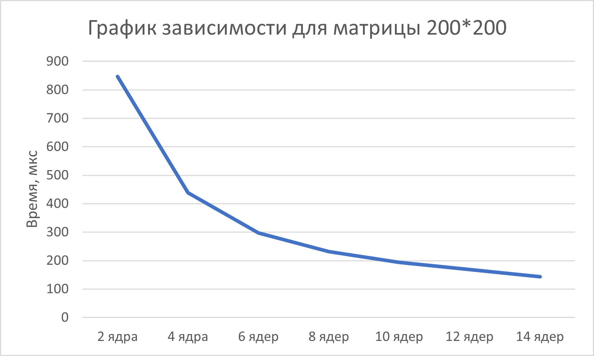
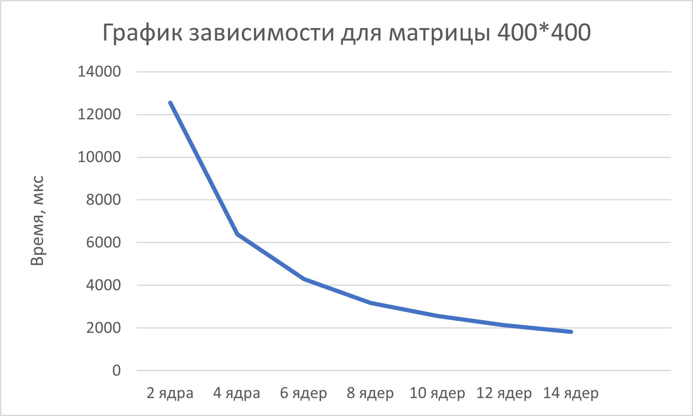
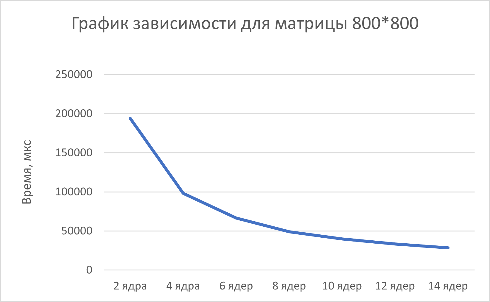
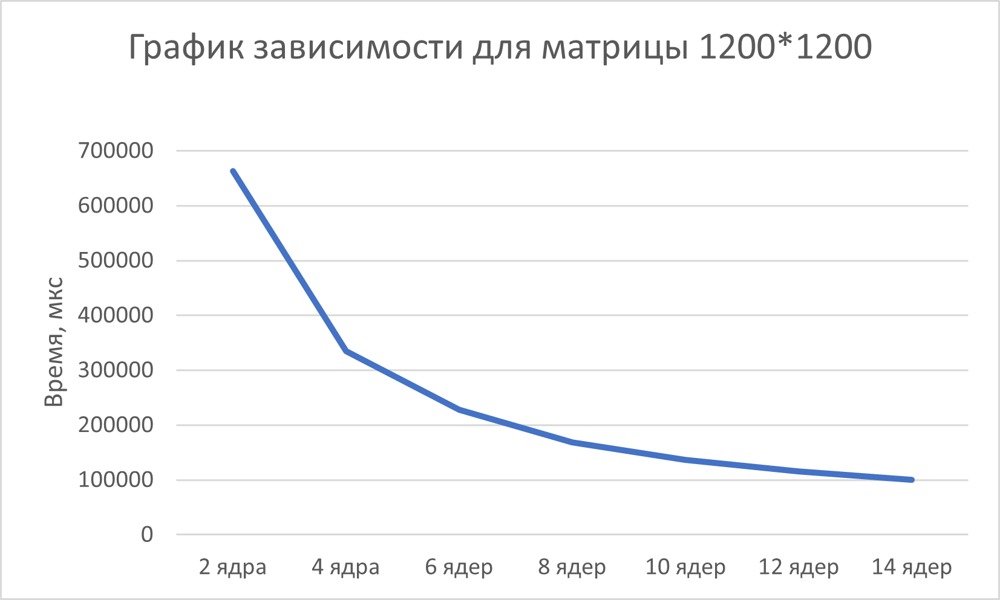
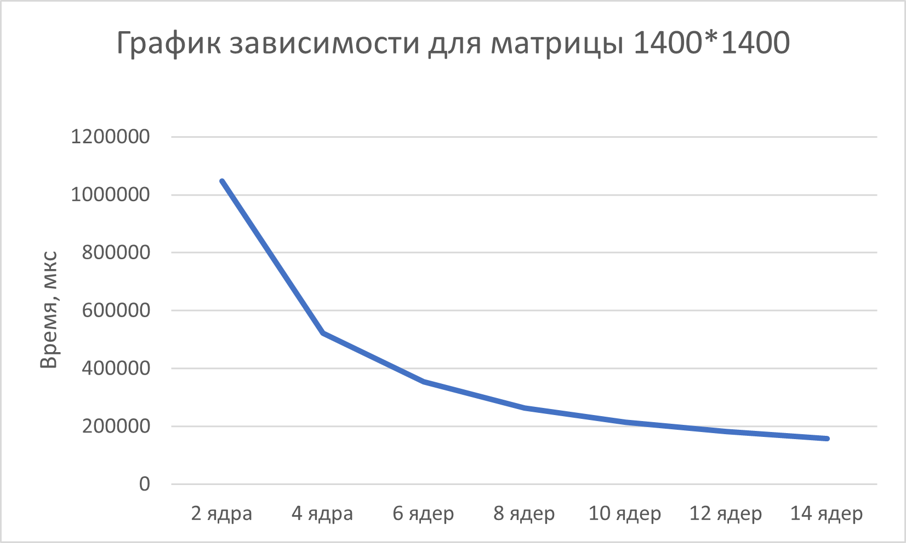
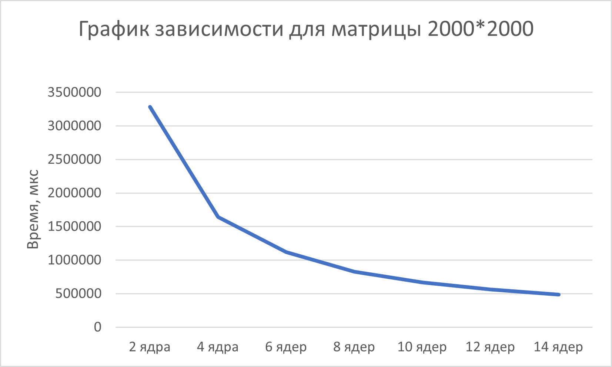

# parallel-programming
Отчёт
Таблица результатов

| Размер матрицы | 2 ядра | 4 ядра | 6 ядер | 8 ядер | 10 ядер | 12 ядер | 14 ядер |
|:--------------:|-------:|-------:|-------:|-------:|--------:|--------:|--------:|
| 200 × 200      | 847    | 438    | 297    | 231    | 194     | 168     | 143     |
| 400 × 400      | 12 547 | 6 392  | 4 289  | 3 176  | 2 558   | 2 134   | 1 829   |
| 800 × 800      | 194 283| 98 147 | 66 312 | 49 058 | 39 867  | 33 289  | 28 624  |
| 1200 × 1200    | 662 847| 334 592| 228 174| 168 493| 136 582 | 115 937 | 100 284 |
| 1400 × 1400    | 1 048 291| 522 176| 354 829| 263 417| 213 694 | 181 736 | 157 392 |
| 2000 × 2000    | 3 284 617| 1 641 928| 1 116 394| 829 637| 667 483 | 562 719 | 484 628 |

Графики:

Варианты всех матриц содержаться внутри проекта
Вывод:
Написав программу на языке С++ для перемножения двух матриц(что включало написания класса матриц с представлением через строку чисел с типом данных double, а также разбиение класса на стандартный список объявления и определения + функция main с демонстрацией всего выше перечисленного) мы провели эксперимент по замеру времени процесса умножения двух матриц, а также сравнили результаты с аналогичным процессом, написанным на Python с использованием встроенных библиотек.Также, следуя заданию, мы модернизировали процесс при помощи принципов технологии MPI и запустили лабораторную работу на суперкомпьютере Сергей Королеёв. Мы получили серьёзный прирост в производительности по статистике в сравнении с обычным пользовательским ноутбуком.Ещё расширилось количество ядер на кототрых мы запускали процесс. Результат оказался вполне приятным, так как финальные файлы совпали по содержимому. Столкнулся единственный раз с проблемой неудовлетворительного чтения файла, который был создан в результате программы, во время верификации и сравнения результатов. Но сие программное беззаконие устранил и получил рабочую систему. В результате мы получили совпадение по результату умножения матриц и время, за которое оно было осуществлено. Также мы составили статитстику результатов, меняя размер матриц и количество потоков.

